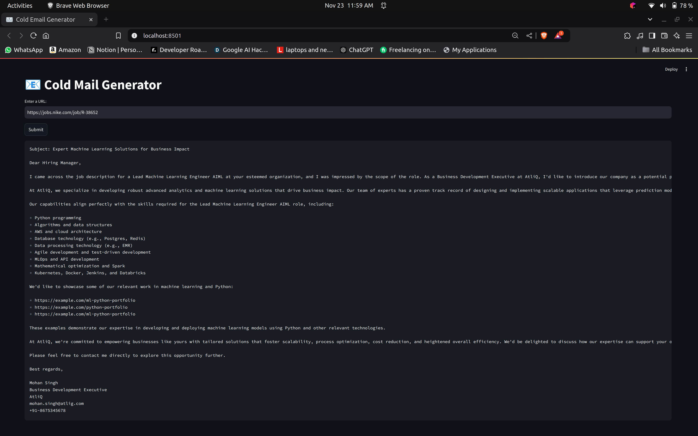

# Cold-Email-Generator


## 🚀 About the Project

The **Cold-Email-Generator** is an AI-powered tool designed to craft highly personalized and professional cold emails for job opportunities and business outreach. By leveraging the power of Generative AI, this project simplifies the process of creating impactful emails to make a strong first impression, ensuring you can focus on delivering value rather than worrying about writing the perfect email.

Currently, the project **does not send emails**, but it generates custom-tailored email drafts based on the job posting URL provided by the user.

---

## 🏗️ How It Works

The **Cold-Email-Generator** accepts a job posting URL as input, extracts relevant details such as job title, required skills, and job description, and generates a cold email tailored to the specific opportunity. The email is crafted in the name of "Mohan Singh," a Business Development Executive at AtliQ, and highlights AtliQ's capabilities relevant to the job.

### Architecture Overview


1. **Input**: Users provide a URL to a job posting.
2. **Extraction**: The project extracts job-related details using a Large Language Model (LLM).
3. **Portfolio Matching**: A vector store is used to find and attach the most relevant portfolio links to the email.
4. **Email Generation**: The LLM generates a custom cold email based on the extracted information and portfolio links.

---

## 🖥️ Screenshot



---

## 🛠️ Tech Stack

The project utilizes the following technologies:

- **Python**: Core programming language.
- **Streamlit**: For the web-based user interface.
- **LangChain**: For prompt engineering and LLM interactions.
- **FAISS**: Vector database for efficient portfolio link matching.
- **Groq**: For job description extraction and preprocessing.

---

## 🚧 Installation

To get started with `Cold-Email-Generator`, follow these steps:

1. **Clone the Repository**:
    ```bash
    git clone https://github.com/hamzaziizzz/Cold-Email-Generator.git
    cd Cold-Email-Generator
    ```

2. **Set up a Python Environment**:
    ```bash
    python -m venv env
    source env/bin/activate  # On Windows: env\Scripts\activate
    ```

3. **Install Dependencies**:
    ```bash
    pip install -r requirements.txt
    ```

4. **Set up Environment Variables**:
    - Create a `.env` file with the following:
      ```env
      GROQ_API_KEY=your_groq_api_key
      ```

5. **Run the Application**:
    ```bash
    streamlit run main.py
    ```

6. **Access the App**:
   Open `http://127.0.0.1:8501` in your browser (or the port specified in your configuration).

---

## 🤝 Contributing

Contributions are welcome! To contribute:

1. Fork the repository.
2. Create a feature branch (`git checkout -b feature-name`).
3. Commit your changes (`git commit -m 'Add feature name'`).
4. Push to the branch (`git push origin feature-name`).
5. Create a Pull Request.

## 🐛 Issues

If you encounter any issues, feel free to raise them [here](https://github.com/hamzaziizzz/Cold-Email-Generator/issues).

## 📫 Contact

For inquiries or support, reach out to [Hamza](https://github.com/hamzaziizzz) or open an issue in the repository.

## 🌐 Live Demo

If hosted, include a live demo link:
[Demo Link](https://cold-email-generation.streamlit.app/)

---

Thank you for using `Cold-Email-Generator`! Contributions and feedback are always appreciated. 🚀
